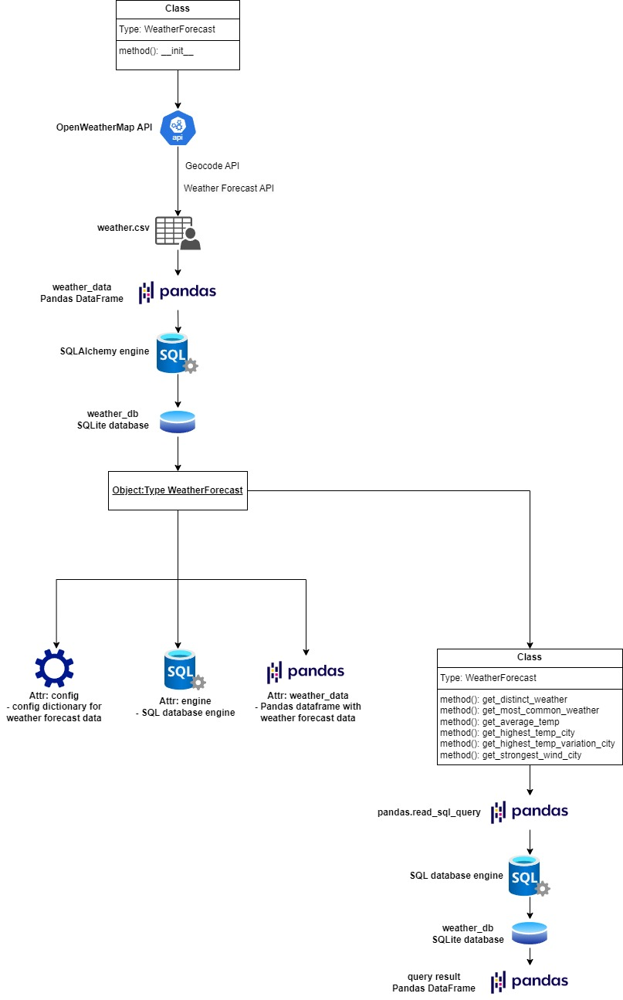

# weather-data-task

This Python program analyzes weather forecast data. It utilizes the [OpenWeatherMap API](https://openweathermap.org/api)
to extract weather forecast data and then loads it into a SQLite database. It is capable to perform several analyzing
operations utilized by the provided WeatherForecast class.

## Features

The main program is utilizing the WeatherForecast class in order to perform the following tasks:

- Extract weather forecast data from OpenWeatherMap API and load it to CSV file and SQLite database.
- Get how many distinct weather conditions were observed in a certain period.
- Get the most common weather conditions in a certain period of time per city.
- Get the average temperatures observed in a certain period per city.
- Get the city with the highest absolute temperature in a certain period of time.
- Get the city with the highest temperature variation in a certain period of time.
- Get the city with the strongest winds in a certain period of time.

## Logical schema



## Folder Structure

```
├───weather-data-task
    ├───config
    │   ├───config-main.json
    │   └───config-test.json	
    ├───data
    │   ├───main_data
    │   │   └───weather.csv
    │   └───test_data
    │       ├───test_responses.json
    │       └───test_weather.csv
    ├───src
    │   ├───main.py
    │   ├───utils.py
    │   ├───weather_class.py
    │   └───weather_db.db
    ├───tests
    │   ├───test_utils.py
    │   └───test_weather_class.py
    ├───gitignore
    ├───README.md
    ├───requirements.txt
    └───WeatherForecastDiagram.jpg
```

## Installation

1. Clone this repository to your local machine:

```shell
git clone <repository_url>
```

2. Set up a virtual environment:

```shell
python3 -m venv .venv
```

3. Activate the virtual environment:

```shell
# Linux or Mac
source .venv/bin/activate
```

```shell
# Windows
.venv/Scripts/activate.bat
```

4. Install the required dependencies:

```shell
pip install -r requirements.txt
```

5. Set the Python path environment variable for the project

```shell
# Linux or Mac
export PYTHONPATH=$(pwd):$(pwd)/src
```

```shell
# Windows
set PYTHONPATH=%cd%;%cd%/src
```

## Configuration

There are config-main.json and config-test.json files in the config directory that specify the configuration
requirements like API key, API urls, locations and file paths.

- config-main.json

```json
{
  "api_key": "<OpenWeatherMap API key>",
  "weather_api": "https://api.openweathermap.org/data/3.0/onecall",
  "geocode_api": "http://api.openweathermap.org/geo/1.0/direct",
  "locations_list": [
    {
      "country": "IT",
      "city": "Milan"
    },
    {
      "country": "IT",
      "city": "Bologna"
    },
    {
      "country": "IT",
      "city": "Cagliari"
    }
  ],
  "weather_data_csv": "../data/main_data/weather.csv",
  "test_responses_json": "../data/test_data/test_responses.json",
  "database": "sqlite:///weather_db.db",
  "table_name": "weather_table"
}
```

## Usage

1. Ensure you have the correct configurations in config-main.json

2. Ensure you are in the src project directory:

```shell
cd src
```

3. Run the main program:

```shell
python main.py
```

## Running Unit Tests

1. Ensure you are in the projects directory

2. Run pytest

```shell
pytest -v tests
```

## Authors

- Stanislav Tsanev - s.tsanev95@abv.bg